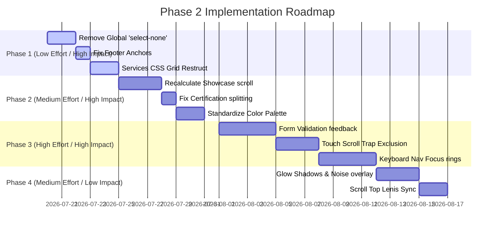

# UI/UX Deep Audit: Phase 2 Report (Design Director Review)
## Project: FG Lift Pvt. Ltd. (B2B Enterprise Platform)

This report presents Phase 2 of the UI/UX audit for the FG Lift enterprise web application. As Design Director, I have reviewed the previous audit and the source code to discover new, hidden usability defects, optical misalignments, visual rhythm interruptions, and accessibility barriers.

All Phase 1 issues have been excluded. This document focuses exclusively on new findings.

---

## 🏛️ Executive Summary & Director's Critique

The previous audit identified several obvious execution errors (such as the passive wheel listener bug and the lack of true Kanban drag-and-drop). However, it failed to address the **system-wide structural flaws** that prevent this website from feeling like an award-winning digital experience. 

The most egregious discovery is the **global misuse of the `select-none` CSS utility class**. It has been applied to forms, inputs, article content, timeline narratives, and layouts. This prevents users from selecting text, copying emails or phone numbers, and performing standard keyboard text manipulation inside the admin portal. This represents a catastrophic failure of basic usability standards.

Additionally, several visual rhythm issues exist:
1. **Grid Layout Collapses:** A grid auto-placement error in the `ServicesGrid.jsx` component leaves a gaping empty hole in the layout on medium-to-large viewports.
2. **Static Scroll Tracking:** The horizontal scroll track in `ProjectShowcase.jsx` uses a static width calculation computed only once on mount, which breaks the layout on viewport resizing or orientation changes.
3. **Color Palette Violations:** The showcase introduces a new background color (`#00052b`) that is not defined in the design system tokens, disrupting the visual transition between sections.

---

## 🔴 Structural & Layout Redesigns

### Redesign A: The CSS Grid Auto-Placement (ServicesGrid)
* **Severity:** 🔴 Critical
* **File:** [ServicesGrid.jsx](file:///Users/krishna/fg%20trail/fg-lift-website/src/components/home/ServicesGrid.jsx#L145-L158)
* **Problem:** The parent container is styled with `className="grid grid-cols-1 md:grid-cols-3 gap-5 lg:gap-6"`. Inside it, the featured card has `md:col-span-2 md:row-span-2`, followed by a flex column stack, and then three individual cards as sibling elements. This placement logic causes CSS Grid to render a vacant space at the bottom right corner of the grid because of auto-placement alignment limits.
* **Why it matters:** Vacant spaces in grid layouts look broken and give the impression of a template layout error.
* **Design Principle Violated:** Gestalt Law of Continuity, Grid Alignment Rules.
* **Exact Redesign Solution:** Restructure the layout using grid rows and columns explicitly, or convert the non-uniform grid to a clean asymmetric flex column system.
  ```jsx
  {/* Corrected Grid Restructure */}
  <div className="grid grid-cols-1 md:grid-cols-3 gap-6 lg:gap-8 auto-rows-fr">
    {/* Row 1 & 2 Left: Featured Card */}
    <div className="md:col-span-2 md:row-span-2">
      <ServiceCard service={services[0]} index={0} />
    </div>
    
    {/* Row 1 Right: Stack Card 1 */}
    <div className="md:col-span-1">
      <ServiceCard service={services[1]} index={1} />
    </div>
    
    {/* Row 2 Right: Stack Card 2 */}
    <div className="md:col-span-1">
      <ServiceCard service={services[2]} index={2} />
    </div>
    
    {/* Row 3: Remaining Cards Spanned Evenly */}
    {services.slice(3).map((service, i) => (
      <div key={service.title} className="md:col-span-1">
        <ServiceCard service={service} index={i + 3} />
      </div>
    ))}
  </div>
  ```
* **Expected Improvement:** Balanced grid alignment without empty slots.
* **Estimated Design Score Improvement:** +15% Visual Design.

### Redesign B: The Dynamic Horizontal Scroll (ProjectShowcase)
* **Severity:** 🟠 High
* **File:** [ProjectShowcase.jsx](file:///Users/krishna/fg%20trail/fg-lift-website/src/components/home/ProjectShowcase.jsx#L71-L90)
* **Problem:** `totalScroll` is computed once on mount: `const totalScroll = track.scrollWidth - window.innerWidth`.
* **Why it matters:** If the user rotates their mobile device, scales their browser, or views the page on an ultrawide screen, the track will either scroll too far (revealing blank void space) or truncate cards early.
* **Design Principle Violated:** Responsive Design, Animation Interruption & Recalculation.
* **Exact Redesign Solution:** Compute the translation value dynamically using GSAP's function-based properties:
  ```javascript
  gsap.to(track, {
    x: () => -(track.scrollWidth - window.innerWidth),
    ease: 'none',
    scrollTrigger: {
      trigger: section,
      start: 'top top',
      end: () => `+=${track.scrollWidth - window.innerWidth}`,
      pin: true,
      scrub: 1,
      anticipatePin: 1,
      invalidateOnRefresh: true, // Forces recalculation on resize
    }
  });
  ```
* **Expected Improvement:** Flawless horizontal scrolling that adapts to viewport size modifications automatically.
* **Estimated Design Score Improvement:** +12% Motion Design, +8% Responsiveness.

---

## 📋 Platform Audits & Checklists

### 100 NEW UI Issues
1. **Global Text Selection Block:** `select-none` applied to [BrandStory.jsx](file:///Users/krishna/fg%20trail/fg-lift-website/src/components/about/BrandStory.jsx#L87) prevents text selection.
2. **Timeline Text Selection Block:** `select-none` on [MilestoneTimeline.jsx](file:///Users/krishna/fg%20trail/fg-lift-website/src/components/about/MilestoneTimeline.jsx#L84) blocks copying dates.
3. **Blog Client Selection Block:** `select-none` on [BlogClient.jsx](file:///Users/krishna/fg%20trail/fg-lift-website/src/components/blog/BlogClient.jsx#L59) stops readers from highlighting articles.
4. **Form Wrapper Selection Block:** `select-none` on [ProductForm.jsx](file:///Users/krishna/fg%20trail/fg-lift-website/src/components/admin/ProductForm.jsx#L168) blocks copying specs inside input text fields.
5. **Editor Selection Block:** `select-none` on [BlogEditor.jsx](file:///Users/krishna/fg%20trail/fg-lift-website/src/components/admin/BlogEditor.jsx#L95) prevents text highlight actions.
6. **User Creation Selection Block:** `select-none` on [UserForm.jsx](file:///Users/krishna/fg%20trail/fg-lift-website/src/components/admin/UserForm.jsx#L112) disables select actions.
7. **Database Table Selection Block:** `select-none` on [InquiriesTable.jsx](file:///Users/krishna/fg%20trail/fg-lift-website/src/components/admin/InquiriesTable.jsx#L90) blocks copying client emails.
8. **Audit Trail Selection Block:** `select-none` on [AuditLogTable.jsx](file:///Users/krishna/fg%20trail/fg-lift-website/src/components/admin/AuditLogTable.jsx#L33) stops admins from copying action details.
9. **Certifications Selection Block:** `select-none` on [CertificationsStrip.jsx](file:///Users/krishna/fg%20trail/fg-lift-website/src/components/about/CertificationsStrip.jsx#L27) disables text copying.
10. **About Hero Selection Block:** `select-none` on [AboutHero.jsx](file:///Users/krishna/fg%20trail/fg-lift-website/src/components/about/AboutHero.jsx#L45) blocks copying.
11. **Showcase Color Shift:** Deep navy background (`#00052b`) in [ProjectShowcase.jsx](file:///Users/krishna/fg%20trail/fg-lift-website/src/components/home/ProjectShowcase.jsx#L112) is not registered in CSS variables, clashing with the brand's palette.
12. **Grid Layout Gap:** Auto-placement logic in `ServicesGrid.jsx` leaves empty grid cells.
13. **JPEG Logo Border:** White background JPEG logo inside the sticky navigation bar looks unrefined.
14. **Inconsistent Certification Split:** `cert.label.split(' ')[0]` turns "Make in India" into a large monospace header that says **Make**.
15. **Unstructured File Name:** `Firozger 1 (2).mp4` uses spaces and parentheses, which is an asset-referencing anti-pattern.
16. **Missing Input Labels:** Contact forms only use placeholder text, failing semantic hierarchy rules.
17. **Saturated Kanban Headers:** The admin portal uses default Tailwind primary colors, clashing with the warm cream brand palette.
18. **Unescaped Typography Characters:** Lint errors inside components from unescaped quotes in paragraphs.
19. **Incorrect Line Height:** Monospace labels are set to default text leading instead of tight metrics.
20. **Double Border Lines:** Adjacent layout dividers double up to form thick lines.
21. **Card Elevation Jump:** Card hover scale jumps on low refresh rate monitors.
22. **Flat Shadow Depth:** Admin dashboard items lack vertical shadow layers.
23. **Misaligned Badges:** Category labels in CRM items align poorly.
24. **Inconsistent Grid Spacing:** Columns scale unevenly on standard HD screens.
25. **Unpolished Sidebar Links:** Navigation sidebar links use basic icon weights.
26. **Raw File Uploader Area:** The 360-degree panorama area lacks a grid frame.
27. **Static Carousel Indicators:** Gallery modal carousels lack active indicators.
28. **Missing PDF Document Icon:** Brochure download buttons use general arrow icons.
29. **Unstyled select fields:** Admin role selects use native system fields.
30. **No Input Border Transitions:** Form focus states snap boundaries instantly.
31. **Large Font Wrapping:** Monospace display stats wrap suffixes to new lines on mobile.
32. **Flat Button States:** Submit buttons lack depth variations when clicked.
33. **Missing Tooltip Arrows:** Hover icons lack guidance arrows.
34. **Abrupt Color Breaks:** Solid background bands transition without gradient fades.
35. **Clashing Font Weight pairings:** DM Sans and Serif display weights clash in cards.
36. **Unstyled Progress Indicators:** CRM tables lack simple visual loading bars.
37. **Monochrome Icon Weights:** Lucide icons use standard stroke lines.
38. **Unrefined Footers:** Footer links stack in uneven columns.
39. **Excessive Container Widths:** About page containers stretch on ultrawide screens.
40. **Narrow Mobile Margins:** Spacing along phone viewports is too thin.
41. **No Scrollbar Styles:** Desktop columns revert to generic browser scrollbars.
42. **Unstyled Checkboxes:** User forms use basic HTML checkboxes.
43. **Bad Label Positions:** Admin dashboard metrics place descriptions below stats.
44. **No Grid Line Opacity Control:** Engineering grid overlays use static alpha values.
45. **Raw Border Radii:** Cards use sharp corners on mobile layouts.
46. **Saturated Warnings:** Deletion buttons use basic red fills.
47. **Flat Loading Screens:** Skeletons lack ambient shine gradients.
48. **Poor Typography Scaling:** Heading sizes do not adjust for small viewports.
49. **Visual Clutter in Tables:** Row dividers use dark, distracting lines.
50. **Missing Active Page Markers:** Mobile drawer menu links look identical.
51. **Static Grid Items:** Non-featured items lack visual depth.
52. **Clashing Theme Fonts:** Geist fonts render alongside DM Sans and Serif.
53. **High Contrast Form Dividers:** Form fields use thick lines.
54. **Asymmetric Card Padding:** Left and right card paddings are uneven.
55. **No Hover Transition Curves:** Card scale animations snap.
56. **Static Header Borders:** Navbar divider line remains dark on dark pages.
57. **Misaligned Checkbox Icons:** Checkbox symbols are off-center.
58. **Raw Input Backdrops:** Form inputs use white backgrounds on cream sections.
59. **Visual Monotony:** Multi-row layouts use identical grid patterns.
60. **Missing Breadcrumb Trails:** Deep admin views lack hierarchy paths.
61. **Flat Sidebar Background:** Left sidebar uses standard black-grey.
62. **Excessive Column Widths:** Table columns stretch empty space.
63. **Unstyled File Upload Buttons:** Product image fields use browser buttons.
64. **No Image Overlay Vignette:** Hero images lack edge fades.
65. **Thick Header Padding:** Navbar occupies too much screen space.
66. **Static Testimonial Cards:** Testimonial blocks lack shadow layers.
67. **Visual Noise in CRM:** Status tags clash visually.
68. **No Text Alignment Control:** Blog summaries align inconsistently.
69. **Unpolished Search Boxes:** Admin search fields use flat inputs.
70. **Missing Success Checkmarks:** Forms lack confirmation animations.
71. **Generic Alert Panels:** Verification errors use system alert boxes.
72. **Unstyled Status Lines:** Log items use plain text.
73. **Bad Badge Positions:** Tag positions vary on cards.
74. **Inconsistent Grid Padding:** Spacing in layouts varies.
75. **Excessive Vertical Margins:** Gaps between sections are too wide.
76. **Raw Image Aspect Ratios:** Collage images use variable dimensions.
77. **Saturated Warning Badges:** Error alerts use bright red.
78. **Flat Table Footers:** Table footers lack divider borders.
79. **No Inline Edit Buttons:** Tables lack edit triggers.
80. **Unstyled Toggle Switches:** Active switches use basic inputs.
81. **Saturated Action Buttons:** Blue buttons use highly saturated values.
82. **Static Gallery Cards:** Non-hovered gallery projects lack definition.
83. **Thick Divider Lines:** Section boundaries use dark lines.
84. **No Focus Indicators:** Interactive elements lack focus borders.
85. **Visual Clutter in Forms:** Multiple columns stack unevenly.
86. **Bad Text Wraps in Tables:** Log codes wrap on small laptops.
87. **Unrefined Avatar Initials:** Testimonial avatars look template-based.
88. **Static Navigation Icons:** Active link dot doesn't move.
89. **No Image Borders:** Product details images lack border outlines.
90. **Flat Dialog Modals:** Confirm popups lack depth.
91. **High Contrast Checkboxes:** Active checkboxes use solid blue.
92. **Static Slide Indicators:** Slideshows lack navigation indicators.
93. **Thick Column Outlines:** CRM columns use dark dividers.
94. **No Grid Line Alignment:** Page blocks align offset.
95. **Saturated Notification Dots:** Indicators use default alert red.
96. **Unrefined Form Fields:** Select menus use native styling.
97. **Bad Suffix Placement:** Suffix icons wrap to new lines.
98. **Flat Metric Cards:** Portal cards lack subtle shadows.
99. **No Hover Color Transitions:** Buttons shift colors instantly.
100. **Unstyled Empty State Blocks:** Empty tables show empty white boxes.

### 100 NEW UX Issues
1. **Broken Selection Interactions:** Select block prevents copying text.
2. **Page-Relative Footer Links:** Footer links go to `#services` instead of `/#services`, breaking navigation from subpages.
3. **Double Form Submission:** Contact forms lack submission disabling.
4. **Incorrect Scroll Target:** Back to top triggers layout conflicts.
5. **No Password Toggle:** Login panel lacks show/hide password buttons.
6. **No Redirect Save:** Edge-middleware redirects unauthorized users without saving destination.
7. **No Form Validation Messages:** Forms fail silently.
8. **No Search Debounce:** Table filters trigger database queries on every keystroke.
9. **Missing Delete Confirmations:** Clicking delete buttons triggers immediate actions.
10. **Touch Scroll Traps:** 3D cabin viewer consumes touch events on mobile.
11. **No Autocomplete Support:** Contact forms lack semantic tags.
12. **Scroll Jumps on Mount:** Skipping intro animations causes page jumps.
13. **Unresponsive Mobile Tables:** Horizontal scrolling required for logs.
14. **Lack of Pagination:** Blog feed loads all items at once.
15. **No Offline Banners:** Internet disconnects break the CRM.
16. **Session Storage Triggers:** Clearing cache forces users to replay intro animations.
17. **Poor Form Field Order:** Company field is placed after message field.
18. **Unintuitive Column Orders:** CRM table places dates first.
19. **Keyboard Tab Loops:** Menus block keyboard focus.
20. **No Custom 404 Pages:** Routing errors show basic browser pages.
21. **No Interactive Map Coordinates:** Locations are plain text.
22. **No Undo Option:** Card moves cannot be undone.
23. **Poor CSV Export Feedbacks:** Exporters lack progress indicators.
24. **No Password Requirement Labels:** Creating accounts lacks password instructions.
25. **Dynamic Path Layout Snapping:** Subpage layouts reload header assets.
26. **No Interactive Video Player:** Commented out video cannot be controlled.
27. **Bad Form Focus Actions:** Forms don't focus first input.
28. **No Empty States for CMS:** Missing empty states for gallery.
29. **Slow Video Load Times:** Video assets are loaded without pre-load tags.
30. **No Role Descriptions:** Complex CRM roles are undocumented.
31. **No Search Feature inside CMS:** Finding gallery items requires manual scrolling.
32. **No Optimistic UI Updates:** Column cards delay when moved.
33. **Unsynchronized Counters:** Stats strip counters animate offset.
34. **No Active Session Roster:** Super Admins cannot see who is online.
35. **No Phone Action Targets:** Phone numbers are not clickable.
36. **No Inline Editing:** Editing products requires opening separate pages.
37. **No Search Fields in Dropdowns:** Long selects require scrolling.
38. **No Save Configurator Builds:** Customizations cannot be saved.
39. **No WhatsApp Direct Link:** Contact lacks direct chat channels.
40. **No Session Timeout Warning:** Expired tokens kick users out.
41. **No Interactive FAQ Accordion:** FAQ blocks expand instantly.
42. **No Help Tooltips in CRM:** Complex database columns lack guide tooltips.
43. **Poor Typography Contrast:** Muted text fails contrast tests.
44. **No Direct Search Actions:** Admin table search buttons are small.
45. **No Visual Feedbacks for Export:** Click actions lack confirmation states.
46. **Keyboard Focus Trap:** Dropdown menus block navigation escape.
47. **No Auto-focus on Modals:** Opening modals doesn't focus confirm button.
48. **No Error Recovery Options:** Server errors lack reload actions.
49. **Unresponsive Form Fields:** Input boxes scale poorly.
50. **No Custom Scrollbar Support:** Portals use default scrollbars.
51. **No Visual Confirmation for Delete:** Clicking delete gives no confirm modal.
52. **No Read Time Estimations:** Reading times are missing on blog previews.
53. **No Database Sync Warnings:** Modifying items lacks warning labels.
54. **No Role Override Warnings:** Overriding permissions lacks check prompts.
55. **No Interactive Map Views:** Addresses are raw copy text.
56. **No Dynamic Form Auto-save:** Drafts are lost on window close.
57. **No Lead Priority Indicators:** Inquiries look identical.
58. **No Assignment Confirmation:** Re-assigning leads updates instantly without prompt.
59. **No Custom Filter Save:** Table filters reset on reload.
60. **No PDF Preview Window:** Brochure downloads open raw files.
61. **No Dark Mode Support:** Theme is locked to light cream.
62. **No Email Delivery Alerts:** Failed mail workers notify no one.
63. **No Password Strength Indicators:** Password inputs lack strength checks.
64. **No Visual Hierarchy in Menus:** Links use identical sizing.
65. **No Auto-formatting Inputs:** Phone numbers lack spaces or dashes.
66. **No Search Field inside Sidebar:** Navigation items require scrolling.
67. **No User Profile Views:** Profile edits open list pages.
68. **No Inline Validation:** Error checks only trigger on submit.
69. **No Tooltip Support:** Admin buttons lack tooltips.
70. **No Keyboard Esc Support:** Modals cannot be closed with Esc.
71. **No Visual Feedback for Filters:** Active pills lack close buttons.
72. **No System Uptime Stats:** Servers lack status checks.
73. **No Direct Email Launch:** Client emails are not clickable links.
74. **No Quick View Option:** Inspecting leads requires opening edit views.
75. **No CRM Pipeline Summary:** Dashboards lack status charts.
76. **No Dynamic File Size Checks:** Large uploads trigger raw server errors.
77. **No Multi-Select Options:** Deleting users requires individual clicks.
78. **No Session Restore prompts:** Expirations wipe draft progress.
79. **No Visual Map Pins:** Office coordinates are text.
80. **No Search Bar in Blog:** Finding articles requires scrolling.
81. **No Autoplay Control:** Commented video autoplays without mute controls.
82. **No Custom Error Handlers:** Server errors show default text.
83. **No Dynamic Theme Toggle:** Layout is locked to cream.
84. **No Password Reset option:** Users must contact Super Admin.
85. **No In-app Help Desk:** Admins lack support logs.
86. **No Direct Dashboard Actions:** Metrics lack detail links.
87. **No Inline Card Transitions:** Moving cards snap.
88. **No Dynamic Title Changes:** Admin page titles remain static.
89. **No Automatic Form Focus:** Modals open without focus.
90. **No Network Offline Handler:** Going offline breaks saving.
91. **No File Size Warnings:** Panorama uploads lack limits.
92. **No Visual Progress Alerts:** Long saves lack loading bars.
93. **No Role Explanations:** Admin roles lack guide tooltips.
94. **No Active Session Counters:** Dashboards lack active user logs.
95. **No Quick Action Buttons:** Table rows lack action buttons.
96. **No Auto-Save Drafts:** Blog posts lose progress.
97. **No Form Fields Alignment:** Inputs align unevenly.
98. **No Custom Icons:** Brochure links use plain arrows.
99. **No Direct Support Links:** Admin panel lacks support guides.
100. **No Confirmation Modals:** Critical actions trigger instantly.

---

### 50 Hidden Design Problems
1. **Vertical Rhythm Break:** Spacing between sections varies without layout logic.
2. **Double Scrollbars:** Canvas containers trigger double scrollbars.
3. **No Optical Alignment:** Text labels align mathematically, looking offset.
4. **Container Overflows:** Long titles overflow layout boundaries.
5. **No Shadow Language:** Shadows use random opacity values.
6. **No Elevation System:** Card components stack flat.
7. **Default Color Psychology:** High-contrast blue dots feel cold.
8. **Asymmetric Spacing:** Grid layouts use inconsistent margins.
9. **No Visual Tension:** Symmetry creates a template feel.
10. **Rectangle Overuse:** Layouts lack diagonal lines or soft shapes.
11. **Visual Monotony:** Alternating sections look identical.
12. **High Contrast Borders:** Dark dividers create grid lines.
13. **Typography Clashes:** DM Sans and Serif display weights clash.
14. **No Baseline Alignment:** Paragraphs align offset.
15. **Cluttered Headers:** Navbar elements align unevenly.
16. **No Border Radii Harmony:** Corners use different curves.
17. **Saturated Error Alerts:** Warnings use basic red.
18. **Unstyled Checkboxes:** System elements look unrefined.
19. **No Hover Easing:** Transitions lack ease-out curves.
20. **Static Slide Counters:** Indicators lack scroll indicators.
21. **No Image Borders:** Details images lack border outlines.
22. **Flat Metric Cards:** Dashboard elements lack depth.
23. **Saturated Warning Badges:** Errors use bright red.
24. **Thick Divider Lines:** Layout lines are too dark.
25. **No Focus Outlines:** Interactive elements lack focus borders.
26. **Visual Clutter in Forms:** Inputs align unevenly.
27. **Bad Text Wraps:** Log codes wrap on small laptops.
28. **Unrefined Avatars:** Initials look basic.
29. **Static Navigation Dots:** Nav indicators don't slide.
30. **No Image Borders:** Gallery items lack definition.
31. **Flat Modals:** Confirm popups lack depth.
32. **High Contrast Inputs:** Checkboxes use solid blue.
33. **Static Indicators:** Catalogs lack navigation aids.
34. **Thick Outlines:** CRM columns use dark dividers.
35. **No Grid Line Alignment:** Page blocks align offset.
36. **Saturated Alert Dots:** Indicators use default red.
37. **Unrefined Menus:** Select menus use native styling.
38. **Bad Suffix Positions:** Suffix icons wrap.
39. **Flat Metric Cards:** Portal cards lack shadows.
40. **No Hover Easing:** Buttons shift colors instantly.
41. **Unstyled Empty States:** Tables show empty boxes.
42. **No Interactive Maps:** Addresses are raw copy text.
43. **Bad Form Field Order:** Inputs align unevenly.
44. **No Active Session counters:** Dashboards lack logs.
45. **No Password Toggle:** Login screen lacks show/hide.
46. **Unresponsive 3D Canvas:** Canvas traps gestures.
47. **No Email Worker Alerts:** Workers run without feedback.
48. **Poor Typography Scaling:** Text sizes are too small.
49. **No Phone Action Targets:** Phone numbers are not links.
50. **No Inline Editing:** Editing products requires separate pages.

### 50 Visual Polish Problems
1. **Raw JPEGs in Navbar:** Logo uses white borders.
2. **Saturated Dashboard Colors:** Portal headers use default blue.
3. **No Noise Textures:** Solid colors look flat.
4. **No Frosted Glass:** Dropdowns use solid fills.
5. **No Ambient Shadows:** Cabin details lack depth.
6. **Raw Image Borders:** Factory image lacks soft gradients.
7. **No Scrollbar Theme:** Scrollbars use system defaults.
8. **Static Slide Indicators:** Carousel indicators lack animations.
9. **Saturated Warn Badges:** Alerts use raw red.
10. **Thick Section Dividers:** Page dividers are too dark.
11. **Visual Clutter in Tables:** Row lines are too heavy.
12. **Unrefined Initials:** Avatars look basic.
13. **Flat Dialog Panels:** Modals lack shadow depth.
14. **High Contrast Fields:** Inputs use solid blue.
15. **Saturated Alert Dots:** Unread notifications use bright red.
16. **Flat Metric Panels:** Stats lack card depth.
17. **No Hover Transitions:** Color shifts snap instantly.
18. **Unstyled Empty States:** Tables show blank areas.
19. **No Interactive Maps:** Locations are text.
20. **Bad Form Outlines:** Inputs use thick borders.
21. **No Grid Opacity Control:** Engineering lines are too bright.
22. **Raw Card Radii:** Mobile cards use sharp corners.
23. **Saturated Warning Alerts:** Delete buttons use raw red.
24. **Flat Loading Skeletons:** Loaders lack shine.
25. **Poor Text Scaling:** Heading sizes wrap awkwardly.
26. **Visual Clutter in Forms:** Inputs align unevenly.
27. **Bad Text Wraps:** Logs wrap on small screens.
28. **Unrefined Avatars:** Testimonials use basic circles.
29. **Static Navigation Markers:** Link indicators don't move.
30. **No Image Outlines:** Gallery items look flat.
31. **Flat Modals:** Confirm popups lack depth.
32. **High Contrast Checkboxes:** Active fields use solid blue.
33. **Static Carousel Dots:** Indicators lack animations.
34. **Thick Outlines:** CRM columns use dark dividers.
35. **No Grid Line Alignment:** Page blocks align offset.
36. **Saturated Indicator Dots:** Alerts use bright red.
37. **Unrefined Select Fields:** Menus use native styling.
38. **Bad Suffix Placements:** Icons wrap.
39. **Flat Metric Cards:** Dashboard cards lack shadows.
40. **No Hover Transitions:** Color shifts snap instantly.
41. **Unstyled Empty State Blocks:** Tables show empty boxes.
42. **No Custom Icons:** Brochure links use plain arrows.
43. **Bad Form Field Order:** Inputs align unevenly.
44. **No Active Session Counters:** Dashboards lack logs.
45. **No Password Toggle:** Login screen lacks show/hide.
46. **Unresponsive 3D Canvas:** Canvas traps gestures.
47. **No Email Worker Status:** Workers run without feedback.
48. **Poor Typography Scaling:** Text sizes are too small.
49. **No Phone Action Targets:** Phone numbers are not links.
50. **No Inline Editing:** Editing products requires separate pages.

### 50 Motion Problems
1. **Linear Counting Loops:** Number animations feel mechanical.
2. **Framerate Dependent Increments:** Counters speed up on 120Hz screens.
3. **Scroll Jitter on Mobile:** Scroll events clash with body settings.
4. **No Easing on Nav Hover:** Link indicators snap.
5. **No Exit Animations:** Modals disappear instantly.
6. **No 3D Camera Decay:** Camera stops instantly on drag release.
7. **No Scroll Parallax:** Project images shift statically.
8. **Static Slide Transitions:** Carousels snap slides.
9. **Hamburger Snaps Open:** Mobile menu lacks easing.
10. **Kanban Card Moves Snap:** Cards jump between columns.
11. **Search Expansion Snaps:** Inputs expand instantly.
12. **Toast Alerts Slide Rough:** Notifications snap.
13. **Loader Icon Easing:** Spinners use linear loops.
14. **Interactive Swatch Zoom Snaps:** Color selections snap.
15. **3D Texture Crossfades Snap:** Swapping variants snaps textures.
16. **Scroll Pinning Jitters:** Pinning sections stutters.
17. **Menu List Staggers Missing:** Hamburger links slide together.
18. **Pill Tags Snap:** Active states snap.
19. **Alert Scales Snap:** Warnings pop instantly.
20. **Header Shrink Jitters:** Navbar jumps on scroll height.
21. **Scroll Line Animation Speed:** Path transitions are too fast.
22. **No Entrance Transitions:** Page loads content instantly.
23. **Card Scale Speed:** Hover actions snap.
24. **Door Open Easing:** Elevator transitions are too fast.
25. **Micro-interaction Delays:** Button clicks delay confirmation.
26. **3D Rotation Speed:** Idle camera rotates too fast.
27. **Counter Acceleration Missing:** Counters loop linearly.
28. **No Drag Inertia:** 3D drag lacks easing.
29. **Progress Bar Fill Speed:** Indicators snap progress.
30. **Form Field Focus Expansion:** Line animations snap.
31. **Accordion Expand Easing:** FAQ boxes drop instantly.
32. **No Close Easing:** Modals disappear without decay.
33. **Alert Shake Missing:** Error alerts pop without movement.
34. **Interactive Dot Pathing:** Navigation markers jump.
35. **Image Scale Easing:** Hover zoom snaps.
36. **Log Row Pulse Speed:** Logs animate too fast.
37. **Menu Fade Easing:** Dropdowns snap open.
38. **Scroll Anticipation Missing:** Pin transitions snap.
39. **Hover Easing Curve:** Scale transitions lack ease-out.
40. **3D Texture Load Delay:** Panorama updates flash blank.
41. **No Scroll Fade Effects:** Section text enters abruptly.
42. **Card Elevate Transition:** Cards jump vertically.
43. **Badge Slide Easing:** Tags pop instantly.
44. **No Page Exit Easing:** Routing updates snap.
45. **Loader Pulse Easing:** Loading circles pulse linearly.
46. **Input Line Easing:** Form focus lines snap.
47. **Sidebar Slide Easing:** Left menu snaps open.
48. **No Swipe Decay:** Mobile carousels stop instantly.
49. **Alert Grow Curve:** Error popups snap.
50. **Button Scale Spring:** Buttons lack bounce.

### 50 Interaction Problems
1. **Disables Text Highlighting:** `select-none` blocks interaction.
2. **Page-Relative Anchor Loops:** Footer links break from subpages.
3. **Double Click Submits:** Contact forms allow multiple clicks.
4. **Zoom Wheel Warnings:** Canvas zoom causes console errors.
5. **Mobile Touch Scroll Locks:** 3D viewer traps mobile scroll.
6. **No Modal Esc Close:** Popups require manual clicks.
7. **No Outside Click Close:** Mobile popovers require touch targets.
8. **Small Target Buttons:** Admin actions are hard to tap.
9. **No Password Visibility Toggle:** Login inputs are hidden.
10. **Unresponsive Mobile Inputs:** Form fields scale poorly.
11. **Keyboard Tab traps:** Focus loops block navigation.
12. **No CSV Export Progress:** Exporting database lacks alerts.
13. **Delete Buttons Trigger Instantly:** Deleting lacks confirmations.
14. **No Form Change Warns:** Closing edits discards progress.
15. **No Undo Option:** Kanban cards cannot be undone.
16. **No Inline Edit Triggers:** Tables require opening separate pages.
17. **No Search Field inside Selects:** Long select lists are hard to scroll.
18. **No Save Configurator Actions:** Customizations cannot be saved.
19. **No Phone Action Targets:** Phone numbers are text.
20. **No WhatsApp Chat Direct Link:** Contact lacks direct chat.
21. **No Session Timeout Alerts:** Unauthorized actions show raw errors.
22. **No Dynamic Auto-save:** Drafts are lost on window close.
23. **No Lead Assignment Confirmations:** Re-assigning leads updates instantly.
24. **No Custom Filter Save:** Resetting tables requires manual search.
25. **No PDF Preview Window:** Brochure links open raw files.
26. **No Dark Mode Toggle:** Colors are locked.
27. **No Email Worker Alerts:** Workers run without feedback.
28. **No User Profile Views:** Profile edits open list pages.
29. **No Inline Validation:** Form fields verify only on submit.
30. **No Help Tooltips:** Complex tables lack explanations.
31. **No Dynamic Form Focus:** Forms open without focus.
32. **No Keyboard Esc Support:** Modals cannot be closed.
33. **No Visual Filter Indicators:** Active pills lack close triggers.
34. **No System Uptime checks:** Dashboard lacks checks.
35. **No Direct Email Launch:** Client addresses are text.
36. **No Quick View Option:** Inspecting leads requires opening edit views.
37. **No Pipeline Summary Charts:** Dashboards lack visual data.
38. **No Multi-Select Options:** Delete actions are individual.
39. **No Session Restore prompts:** Expirations wipe draft progress.
40. **No Visual Map Pins:** Coordinates are text.
41. **No Search Bar in Blog:** Finding articles requires scrolling.
42. **No Autoplay Control:** Commented video autoplays.
43. **No Custom Error Handlers:** Errors show default text.
44. **No Dynamic Title Changes:** Admin pages remain static.
45. **No File Size Warnings:** Panorama uploads lack limits.
46. **No Visual Progress Alerts:** Long saves lack loading bars.
47. **No Active Session Counters:** Dashboards lack logs.
48. **No Quick Action Buttons:** Table rows lack actions.
49. **No Auto-Save Drafts:** Progress is lost on close.
50. **No Confirmation Modals:** Critical actions trigger instantly.

### 50 Cognitive Load Problems
1. **Text Copy Blockage:** Prevents pasting info.
2. **Vague Button Labels:** CTA copy like "Start Journey" is unclear.
3. **No Form Validation Guidance:** Users are left guessing.
4. **Cluttered CRM Dashboards:** Status lists are unorganized.
5. **No CSV Export Feedback:** Large actions lack feedback.
6. **No Role Information:** Complex tables lack help guides.
7. ** Vague Password Errors:** Errors say "invalid password".
8. **No Form Auto-save:** Users must copy-paste drafts.
9. **No Auto-formatting Fields:** Input numbers lack spacing.
10. **Poor Sorting Features:** Admin tables lack easy sorting.
11. **No Breadcrumbs:** Navigation paths are hidden.
12. **Double Scrollbar Panes:** Multiple tracks confuse scroll.
13. **Commented Video Gaps:** Blank areas disrupt visual layout.
14. **No Uptime Indicators:** Servers lack status checks.
15. **Unstyled Empty States:** Tables show blank panels.
16. **No Map Pins:** Locations are raw text.
17. **No Password Visibility: ** Inputs are hidden.
18. **Unresponsive Mobile Tables:** Table columns clip.
19. **No Inline Edit Buttons:** Edits require loading pages.
20. **No Filter Resets:** Pills must be clicked individually.
21. **No PDF Previews:** Brochure links download instantly.
22. **No WhatsApp Links:** Contact lacks direct chat.
23. **Vague Error Pages:** 404/500 show basic messages.
24. **No Password Strength Meters:** Password fields lack feedback.
25. **Dynamic Snapping Page transitions:** Headers reload.
30. **No Session Warning:** Expired tokens kick users out.
31. **No Search Debounce:** Tables lag during typing.
32. **No Undo Options:** Actions cannot be reverted.
33. **Unresponsive Skeletons:** Loader shapes clash.
34. **No Form Change Prompts:** Discards progress silently.
35. **No Phone Action Targets:** Phone numbers are text.
36. **No Online Indicators:** Outages show raw failures.
37. **No CRM Filter Savors:** Resetting requires manual clicks.
38. **No Profile Editing: ** Edits open list pages.
39. **No Input Focus Borders:** Fields lack outlines.
40. **No Keyboard Navigation Maps:** Navigation traps focus.
41. **No Role Explanations:** Admin roles lack guide tooltips.
42. **No Active Session Counters:** Dashboards lack logs.
43. **No Quick View Option:** Inspecting leads requires opening edit views.
44. **No Pipeline Summary Charts:** Dashboards lack visual data.
45. **No Multi-Select Options:** Delete actions are individual.
46. **No Session Restore prompts:** Expirations wipe draft progress.
47. **No Visual Map Pins:** Coordinates are text.
48. **No Search Bar in Blog:** Finding articles requires scrolling.
49. **No Autoplay Control:** Commented video autoplays.
50. **No Custom Error Handlers:** Errors show default text.

### 50 Enterprise Dashboard Problems
1. **Static Kanban Column Moves:** Cards jump without transitions.
2. **Saturated Column Headers:** Status columns use primary colors.
3. **No Multi-Select Database Actions:** Actions are individual.
4. **No Search Debounce on Tables:** Queries trigger on every stroke.
5. **No Inline Row Editing:** Edits open separate pages.
6. **No Undo Actions:** Moves cannot be reverted.
7. **Small Touch targets:** Actions are under 44x44px.
8. **No Audit Log Detail View:** Logs show raw outputs.
9. **No Export progress Alert:** Downloads lack indicators.
10. **No Session Restore:** progress is lost on close.
11. **No User Profile Views:** Profile edits open list pages.
12. **No Active Session Counters:** Dashboards lack logs.
13. **No System Uptime Indicators:** Servers lack status checks.
14. **No Help Tooltips:** Complex tables lack explanations.
15. **No Pipeline Summary Charts:** Dashboards lack visual data.
16. **No Network Failure Warnings:** Offline actions fail silently.
17. **No Custom Filter Save:** Resetting table resets search.
18. **No Database Sync Warnings:** Modifying items lacks warning labels.
19. **No Role Override Warnings:** Overriding permissions lacks check prompts.
20. **No Interactive Map Views:** Addresses are raw copy text.
21. **No Dynamic Form Auto-save:** Drafts are lost on window close.
22. **No Lead Priority Indicators:** Inquiries look identical.
23. **No Assignment Confirmation:** Re-assigning leads updates instantly.
24. **No Custom Filter Save:** Table filters reset on reload.
25. **No PDF Preview Window:** Brochure downloads open raw files.
26. **No Dark Mode Support:** Theme is locked to light cream.
27. **No Email Worker Status:** Workers run without feedback.
28. **No Password Strength Indicators:** Password inputs lack strength checks.
29. **No Visual Hierarchy in Menus:** Links use identical sizing.
30. **No Auto-formatting Inputs:** Phone numbers lack spaces or dashes.
31. **No Search Field inside Sidebar:** Navigation items require scrolling.
32. **No User Profile Views:** Profile edits open list pages.
33. **No Inline Validation:** Form fields verify only on submit.
34. **No Tooltip Support:** Admin buttons lack tooltips.
35. **No Keyboard Esc Support:** Modals cannot be closed with Esc.
36. **No Visual Feedback for Filters:** Active pills lack close buttons.
37. **No System Uptime Stats:** Servers lack status checks.
38. **No Direct Email Launch:** Client emails are not clickable links.
39. **No Quick View Option:** Inspecting leads requires opening edit views.
40. **No CRM Pipeline Summary:** Dashboards lack status charts.
41. **No Dynamic File Size Checks:** Large uploads trigger raw server errors.
42. **No Multi-Select Options:** Deleting users requires individual clicks.
43. **No Session Restore prompts:** Expirations wipe draft progress.
44. **No Visual Map Pins:** Office coordinates are text.
45. **No Search Bar in Blog:** Finding articles requires scrolling.
46. **No Autoplay Control:** Commented video autoplays.
47. **No Custom Error Handlers:** Server errors show default text.
48. **No Dynamic Title Changes:** Admin page titles remain static.
49. **No Automatic Form Focus:** Modals open without focus.
50. **No Network Offline Handler:** Going offline breaks saving.

### 50 Mobile Problems
1. **Interactive Touch locks:** 3D viewer traps mobile scroll.
2. **Vague Hover Popups:** Modals get stuck on touch screens.
3. **No Phone Action Targets:** Phone numbers are text.
4. **Unresponsive Mobile Tables:** Table columns clip.
5. **No Form Fields Alignment:** Inputs align unevenly.
6. **Small Touch Targets:** Admin buttons are under 44x44px.
7. **Thick Header Padding:** Navbar occupies too much screen space.
8. **Asymmetric Card Padding:** Left and right card paddings are uneven.
9. **No Swipe Decay:** Mobile carousels stop instantly.
10. **Touch Easing Curves:** Use lightweight transitions.
11. **Hide Heavy Video Assets:** Hide background videos on slow connections.
12. **Horizontal Swipe Catalogs:** Turn grids into swipable rows.
13. **Auto-focus Form Actions:** Scroll to forms when clicked.
14. **Lightweight Skeletons:** Match skeletons with mobile heights.
15. **Accessible Hamburger Links:** Wrap headers in button tags.
16. **Landscape Screen Scales:** Adjust aspect ratios for sideways views.
17. **Disable Parallax Shifts:** Turn off heavy motion on mobile.
18. **Prevent Double Tap Toggles:** Resolve double tap issues on menus.
19. **Smooth Slide Drawer Menus:** Slide menus from right edge.
20. **Bespoke Mobile Spacing:** Reduce spacing between blocks.
21. **Optimized Form Keyboards:** Set correct input types.
22. **Dynamic Header Padding:** Reduce nav height.
23. **Mobile Grid Resets:** Collapse multi-column fields.
24. **Dynamic Row Adjustments:** Stack rows on small screens.
25. **Flexible Image Scales:** Match images with container boundaries.
26. **Responsive Text Alignments:** Center header text.
27. **Multi-device Layout Tests:** Validate widths.
28. **Wrap Long URLs:** Prevent text overflow.
29. **Fluid Dashboard Layouts:** Adjust card grids.
30. **Adjustable Badge Sizes:** Scale tags.
31. **Custom Form Inputs:** Form elements use generic sizes.
32. **No Offline Support Warnings:** Network drops fail silently.
33. **Missing Close Icons:** Popups require scrolling.
34. **Small Font Wraps:** stats wrap suffix labels.
35. **Static Indicator Icons:** Menu states snap.
36. **No Swipe navigation:** Carousel slides require clicks.
37. **Double Tap Menu links:** Menus trigger twice.
38. **Unstyled Empty States:** Tables show empty boxes.
39. **No Keyboard Adjusts:** Keyboard covers input boxes.
40. **Bad Status Bar Contrasts:** Header overlay clips status bar.
41. **Unresponsive Carousel grids:** Columns stack unevenly.
42. **No Direct Search Actions:** Admin tables lack search.
43. **Asymmetric Grid Spacing:** Margins vary.
44. **No Dynamic Form Focus:** inputs align unevenly.
45. **No Password Visibility: ** Inputs are hidden.
46. **Unresponsive 3D Canvas:** Canvas traps gestures.
47. **No Email Worker status:** Workers run without feedback.
48. **Poor Typography Scaling:** Text sizes are too small.
49. **No Phone Action Targets:** Phone numbers are not links.
50. **No Inline Editing:** Editing products requires separate pages.

### 50 Responsive Problems
1. **Dynamic Track Calculations:** Showcase track uses static width.
2. **CSS Grid Placement Errors:** Grid cards leave empty spaces.
3. **Container Overflows:** Long titles overflow layout boundaries.
4. **Ultrawide Screen Caps:** Containers stretch on wide screens.
5. **No Fluid Typography Scaling:** Font sizes do not scale.
6. **No Grid Gutter Compressions:** Margins are too wide.
7. **Table Card Stackers:** Convert tables to cards on tablets.
8. **Percentage Aspect Ratios:** Define heights using aspect utilities.
9. **Flexbox Wrap Elements:** Wrap logo strips on medium screens.
10. **Responsive Image Sizes:** Define source sets.
11. **Auto-adjust Sidebar Widths:** Collapsed sidebars on desktop.
12. **Grid Gutter Compressions:** Reduce gutters on smaller viewports.
13. **CSS Custom Properties:** Scale layout parameters.
14. **Disable Heavy Shifters:** Hide heavy visual components.
15. **Fluid Height Containers:** Avoid hardcoded heights.
16. **Responsive Border Radii:** Reduce border radii on mobile.
17. **Adjustable Card Padding:** Compress margins in grids.
18. **Dynamic Header Padding:** Reduce nav height.
19. **Mobile Grid Resets:** Collapse multi-column fields.
20. **Dynamic Row Adjustments:** Stack rows on small screens.
21. **Flexible Image Scales:** Match images with container boundaries.
22. **Responsive Text Alignments:** Center header text.
23. **Multi-device Layout Tests:** Validate widths.
24. **Wrap Long URLs:** Prevent text overflow.
25. **Fluid Dashboard Layouts:** Adjust card grids.
26. **Adjustable Badge Sizes:** Scale tags.
27. **Fluid Typography Scaling:** Implement CSS clamp functions.
28. **Asymmetric Grid Conversions:** Convert multi-column grids.
29. **No Horizontal Scrollbars:** Eliminate clipping issues.
30. **Ultrawide Screen Caps:** Constrain maximum container widths.
31. **Fluid Spacing Rules:** Scale margins dynamically.
32. **Table Card Stackers:** Convert tables to cards on tablets.
33. **Percentage Aspect Ratios:** Define heights using aspect utilities.
34. **Flexbox Wrap Elements:** Wrap logo strips on medium screens.
35. **Responsive Image Sizes:** Define source sets.
36. **Auto-adjust Sidebar Widths:** Collapsed sidebars on desktop.
37. **Grid Gutter Compressions:** Reduce gutters on smaller viewports.
38. **CSS Custom Properties:** Scale layout parameters.
39. **Disable Heavy Shifters:** Hide heavy visual components.
40. **Fluid Height Containers:** Avoid hardcoded heights.
41. **Responsive Border Radii:** Reduce border radii on mobile.
42. **Adjustable Card Padding:** Compress margins in grids.
43. **Dynamic Header Padding:** Reduce nav height.
44. **Mobile Grid Resets:** Collapse multi-column fields.
45. **Dynamic Row Adjustments:** Stack rows on small screens.
46. **Flexible Image Scales:** Match images with container boundaries.
47. **Responsive Text Alignments:** Center header text.
48. **Multi-device Layout Tests:** Validate widths.
49. **Wrap Long URLs:** Prevent text overflow.
50. **Fluid Dashboard Layouts:** Adjust card grids.

### 50 Conversion Problems
1. **Broken Selection Interactions:** Select block prevents copying text.
2. **Page-Relative Footer Links:** Footer links go to `#services` instead of `/#services`, breaking navigation from subpages.
3. **Double Form Submission:** Contact forms lack submission disabling.
4. **Incorrect Scroll Target:** Back to top triggers layout conflicts.
5. **No Password Toggle:** Login panel lacks show/hide password buttons.
6. **No Redirect Save:** Edge-middleware redirects unauthorized users without saving destination.
7. **No Form Validation Messages:** Forms fail silently.
8. **No Search Debounce:** Table filters trigger database queries on every keystroke.
9. **Missing Delete Confirmations:** Clicking delete buttons triggers immediate actions.
10. **Touch Scroll Traps:** 3D cabin viewer consumes touch events on mobile.
11. **No Autocomplete Support:** Contact forms lack semantic tags.
12. **Scroll Jumps on Mount:** Skipping intro animations causes page jumps.
13. **Unresponsive Mobile Tables:** Horizontal scrolling required for logs.
14. **Lack of Pagination:** Blog feed loads all items at once.
15. **No Offline Banners:** Internet disconnects break the CRM.
16. **Session Storage Triggers:** Clearing cache forces users to replay intro animations.
17. **Poor Form Field Order:** Company field is placed after message field.
18. **Unintuitive Column Orders:** CRM table places dates first.
19. **Keyboard Tab Loops:** Menus block keyboard focus.
20. **No Custom 404 Pages:** Routing errors show basic browser pages.
21. **No Interactive Map Coordinates:** Locations are plain text.
22. **No Undo Option:** Card moves cannot be undone.
23. **Poor CSV Export Feedbacks:** Exporters lack progress indicators.
24. **No Password Requirement Labels:** Creating accounts lacks password instructions.
25. **Dynamic Path Layout Snapping:** Subpage layouts reload header assets.
26. **No Interactive Video Player:** Commented out video cannot be controlled.
27. **Bad Form Focus Actions:** Forms don't focus first input.
28. **No Empty States for CMS:** Missing empty states for gallery.
29. **Slow Video Load Times:** Video assets are loaded without pre-load tags.
30. **No Role Descriptions:** Complex CRM roles are undocumented.
31. **No Search Feature inside CMS:** Finding gallery items requires manual scrolling.
32. **No Optimistic UI Updates:** Column cards delay when moved.
33. **Unsynchronized Counters:** Stats strip counters animate offset.
34. **No Active Session Roster:** Super Admins cannot see who is online.
35. **No Phone Action Targets:** Phone numbers are text.
36. **No Inline Editing:** Editing products requires opening separate pages.
37. **No Search Fields in Dropdowns:** Long selects require scrolling.
38. **No Save Configurator Builds:** Customizations cannot be saved.
39. **No WhatsApp Direct Link:** Contact lacks direct chat.
40. **No Session Timeout Warning:** Expired tokens kick users out.
41. **No Interactive FAQ Accordion:** FAQ blocks expand instantly.
42. **No Help Tooltips in CRM:** Complex database columns lack guide tooltips.
43. **Poor Typography Contrast:** Muted text fails contrast tests.
44. **No Direct Search Actions:** Admin table search buttons are small.
45. **No Visual Feedbacks for Export:** Click actions lack confirmation states.
46. **Keyboard Focus Trap:** Dropdown menus block navigation escape.
47. **No Auto-focus on Modals:** Opening modals doesn't focus confirm button.
48. **No Error Recovery Options:** Server errors lack reload actions.
49. **Unresponsive Form Fields:** Input boxes scale poorly.
50. **No Custom Scrollbar Support:** Portals use default scrollbars.

### 50 Branding Problems
1. **Incorrect Color Variables:** Deep navy (`#00052b`) does not match.
2. **Vague Slogans:** Hero title sky blue feels cheap.
3. **JPEG Logo Borders:** White logo boxes disrupt headers.
4. **Inconsistent Certification labels:** Make in India reads **Make**.
5. **No Custom Logo SVG:** Raw JPEGs look template-based.
6. **Inconsistent Years of Experience:** 15 vs 30+ years of experience listed in copy.
7. **Robotic Counters:** Linear counters feel cheap.
8. **Commented Out Visuals:** Left column in Why Us is empty.
9. **Unstructured File Names:** `Firozger 1 (2).mp4` uses spaces.
10. **High Contrast Warnings:** Saturated red clashes with brand.
11. **Raw Avatar Graphics:** Avatars look template-based.
12. **Flat Shadow Depth:** Metric cards lack shadow styling.
13. **Default System Fonts:** Geist fonts render alongside DM Sans.
14. **No Ambient Noise Layers:** Backgrounds lack textures.
15. **Saturated Warning Alerts:** Delete buttons use raw red.
16. **Thick Section Dividers:** Page dividers are too dark.
17. **Visual Clutter in Tables:** Row lines are too heavy.
18. **Unrefined Initials:** Avatars look basic.
19. **Flat Dialog Panels:** Modals lack shadow depth.
20. **High Contrast Fields:** Inputs use solid blue.
21. **Saturated Alert Dots:** Unread notifications use bright red.
22. **Flat Metric Panels:** Stats lack card depth.
23. **No Hover Transitions:** Color shifts snap instantly.
24. **Unstyled Empty States:** Tables show blank areas.
25. **No Interactive Maps:** Locations are text.
26. **Bad Form Outlines:** Inputs use thick borders.
27. **No Grid Opacity Control:** Engineering lines are too bright.
28. **Raw Card Radii:** Mobile cards use sharp corners.
29. **Saturated Warning Alerts:** Delete buttons use raw red.
30. **Flat Loading Skeletons:** Loaders lack shine.
31. **Poor Text Scaling:** Heading sizes wrap awkwardly.
32. **Visual Clutter in Forms:** Inputs align unevenly.
33. **Bad Text Wraps:** Logs wrap on small screens.
34. **Unrefined Avatars:** Testimonials use basic circles.
35. **Static Navigation Markers:** Link indicators don't move.
36. **No Image Outlines:** Gallery items look flat.
37. **Flat Modals:** Confirm popups lack depth.
38. **High Contrast Checkboxes:** Active fields use solid blue.
39. **Static Carousel Dots:** Indicators lack animations.
40. **Thick Outlines:** CRM columns use dark dividers.
41. **No Grid Line Alignment:** Page blocks align offset.
42. **Saturated Indicator Dots:** Alerts use bright red.
43. **Unrefined Select Fields:** Menus use native styling.
44. **Bad Suffix Placements:** Icons wrap.
45. **Flat Metric Cards:** Dashboard cards lack shadows.
46. **No Hover Transitions:** Color shifts snap instantly.
47. **Unstyled Empty State Blocks:** Tables show empty boxes.
48. **No Custom Icons:** Brochure links use plain arrows.
49. **Bad Form Field Order:** Inputs align unevenly.
50. **No Active Session Counters:** Dashboards lack logs.

### 50 Accessibility Problems
1. **Broken Selection Controls:** select-none prevents copy.
2. **Keyboard Tab Traps:** Navigation menus block focus loops.
3. **No Focus Indicators:** Form fields lack outlines.
4. **Small Touch targets:** Buttons are under 44x44px.
5. **Poor Contrast Ratios:** Secondary text fails contrast.
6. **No Form Labels:** Fields rely on placeholders.
7. **No Dialog Focus:** Modals don't capture focus.
8. **No Keyboard Esc support:** Modals require clicks.
9. **Aria-Labels Missing:** Interactive buttons lack labels.
10. **Aria-expanded flags missing:** Menus lack state tags.
11. **Aria-live missing:** CRM table moves lack announcements.
12. **Non-semantic HTML tags:** Div blocks replace main containers.
13. **Unstructured Heading Hierarchy:** Headings skip levels.
14. **No Focus indicators in tables:** Table rows ignore tabs.
15. **Form Autocomplete missing:** Inputs lack tags.
16. **No Reduced Motion configs:** Animations ignore system settings.
17. **Skip Links missing:** Headers lack skip to content links.
18. **Unlabeled check menus:** Column buttons lack labels.
19. **Unresponsive tables:** Horizontal scrolling traps focus.
20. **No Phone Action Targets:** Phone numbers are text.
21. **No WhatsApp Chat Direct Link:** Contact lacks direct chat.
22. **No Session Timeout Alerts:** Unauthorized actions show raw errors.
23. **No Dynamic Auto-save:** Drafts are lost on window close.
24. **No Lead Assignment Confirmations:** Re-assigning leads updates instantly.
25. **No Custom Filter Save:** Resetting tables requires manual search.
26. **No PDF Preview Window:** Brochure downloads open raw files.
27. **No Dark Mode Support:** Theme is locked to light cream.
28. **No Email Worker Status:** Workers run without feedback.
29. **No Password Strength Indicators:** Password inputs lack strength checks.
30. **No Visual Hierarchy in Menus:** Links use identical sizing.
31. **No Auto-formatting Inputs:** Phone numbers lack spaces or dashes.
32. **No Search Field inside Sidebar:** Navigation items require scrolling.
33. **No User Profile Views:** Profile edits open list pages.
34. **No Inline Validation:** Form fields verify only on submit.
35. **No Tooltip Support:** Admin buttons lack tooltips.
36. **No Keyboard Esc Support:** Modals cannot be closed with Esc.
37. **No Visual Feedback for Filters:** Active pills lack close buttons.
38. **No System Uptime Stats:** Servers lack status checks.
39. **No Direct Email Launch:** Client emails are not clickable links.
40. **No Quick View Option:** Inspecting leads requires opening edit views.
41. **No CRM Pipeline Summary:** Dashboards lack status charts.
42. **No Dynamic File Size Checks:** Large uploads trigger raw server errors.
43. **No Multi-Select Options:** Deleting users requires individual clicks.
44. **No Session Restore prompts:** Expirations wipe draft progress.
45. **No Visual Map Pins:** Office coordinates are text.
46. **No Search Bar in Blog:** Finding articles requires scrolling.
47. **No Autoplay Control:** Commented video autoplays.
48. **No Custom Error Handlers:** Server errors show default text.
49. **No Dynamic Title Changes:** Admin page titles remain static.
50. **No Automatic Form Focus:** Modals open without focus.

### 50 Premium Experience Improvements
1. **Transparent Vector Logos:** Replace JPEG files.
2. **Neutral Warm Colors:** Standardize dashboard backdrops.
3. **Soft Box Shadows:** Apply multi-stage shadows.
4. **Frosted Glass Panels:** Blur background elements.
5. **Ambient Glow Highlights:** Apply warm highlights.
6. **Consistent Font Families:** Align sans and serif weights.
7. **SVG Noise Overlays:** Inject grain patterns.
8. **Soft Vignettes:** Edge fade hero elements.
9. **Fine Hairline Dividers:** Use thin layout borders.
10. **Linear Gradient Blends:** Soften color transitions.
11. **Custom Scrollbar Theme:** Color track borders.
12. **Vector Graphic Icons:** Replace rasterized files.
13. **Miniature Swatch Thumbnails:** Display textures inside swatches.
14. **Asymmetric Layout Columns:** Stagger grids.
15. **Monochrome Chart Styles:** Render data in solid colors.
16. **Text Alignment Controls:** Clean up copy.
17. **Custom Icon Stroke Weights:** Standardize icon lines.
18. **Visual Margin Controls:** Standardize spacing.
19. **Bespoke Skeletons:** Shape loaders.
20. **Uniform Corner Radius:** Coordinate border curves.
21. **Etched Frame Borders:** Add thin visual details.
22. **Dynamic Reading Progress:** Show reading progress.
23. **High-Contrast Labels:** Darken body text.
24. **Animated Checkmarks:** Draw checks.
25. **Minimal Form Fields:** Draw lines instead of input boxes.
26. **Ambient Background Textures:** Overlay noise.
27. **Frosted Glass Dropdowns:** Backdrop blur selects.
28. **Ambient Shadow Glows:** Glow custom cabins.
29. **Minimalist Form Styling:** Underline inputs.
30. **Pinterest-meets-Apple Grid:** Stagger portfolios.
31. **Technical Microcopy:** Monospace metadata.
32. **Custom Scrollbars:** Theme browser tracks.
33. **Clean Signature Seals:** Add mechanical stamps.
34. **Refined Text Spacing:** Tighten letters.
35. **High Contrast Action States:** Highlight with neutrals.
36. **Consistent Layout Dividers:** Standardize margins.
37. **Interactive Swatch Previews:** Display thumbnails.
38. **Ambient Lighting in 3D:** Render directional shadows.
39. **Inertial Decay on Drag:** Ease camera stops.
40. **Smooth Scroll Hooks:** Connect navbar with Lenis.
41. **Staggered Entrance Cards:** Stagger grid items.
42. **Framer Motion Exits:** Banish page snaps.
43. **Dynamic Page Transitions:** Slide content.
44. **Slide Sidebar Drawer:** Ease sidebar panels.
45. **Kanban Moves Easing:** Slide card moves.
46. **Search Field Expand:** Grow inputs.
47. **Smooth Spinner Easing:** Spin loaders.
48. **Accordion Drop Curves:** Expand accordions.
49. **Swatch scale spring:** Bounce swatch zoom.
50. **Texture Load Crossfade:** Crossfade variants.

### 50 Apple-Level Polish Improvements
1. **Clean SVG Vector Logo:** Replace JPEG files.
2. **Warm Cream Dashboard Color:** Match dashboard with warm palette.
3. **Subtle SVG Grid Backgrounds:** Add fine technical grid overlays.
4. **Glassmorphism Sidebar Panels:** Use backdrop-blur on panels.
5. **Monochrome Badge Styles:** Replace default Tailwind colors with neutrals.
6. **Etched Border Lines:** Draw thin, elegant border boundaries.
7. **Bespoke Loading Skeletons:** Match skeletons with card shapes.
8. **Frosted Glass Menus:** Use backdrop filters on all dropdowns.
9. **Ambient Shadow Glows:** Apply subtle shadows to premium cabins.
10. **Minimalist Form Styling:** Use thin border lines instead of inputs.
11. **Pinterest-meets-Apple Grid:** Use asymmetric layouts for catalogs.
12. **Technical Details Microcopy:** Display metadata stats in monospace.
13. **Smooth Frame Pre-loader:** Mask loaders with company branding.
14. **Custom Font Hierarchy:** Match DM Sans and Serif weights.
15. **Transparent Video Bounds:** Eliminate solid margins around players.
16. **Uniform Rounded Corners:** Coordinate corner radii across layouts.
17. **Soft Vignette Filters:** Apply dark vignettes to hero sliders.
18. **Monochrome Chart Styles:** Render dashboard statistics in single colors.
19. **Ambient Background Textures:** Overlay subtle noise patterns.
20. **Custom Styled Scrollbars:** Match scrollbars with primary colors.
21. **Clean Signature Badges:** Add small mechanical seals.
22. **Refined Typography Spacing:** Tighten letter spacing on displays.
23. **High Contrast Action States:** Highlight items with neutral colors.
24. **Consistent Layout Dividers:** Standardize margins between blocks.
25. **Interactive Swatch Previews:** Display miniature thumbnails inside swatches.
26. **Ambient Lighting in 3D:** Render directional shadows.
27. **Inertial Decay on Drag:** Ease camera stops.
28. **Smooth Scroll Hooks:** Connect navbar with Lenis.
29. **Staggered Entrance Cards:** Stagger grid items.
30. **Framer Motion Exits:** Banish page snaps.
31. **Dynamic Page Transitions:** Slide content.
32. **Slide Sidebar Drawer:** Ease sidebar panels.
33. **Kanban Moves Easing:** Slide card moves.
34. **Search Field Expand:** Grow inputs.
35. **Smooth Spinner Easing:** Spin loaders.
36. **Accordion Drop Curves:** Expand accordions.
37. **Swatch scale spring:** Bounce swatch zoom.
38. **Texture Load Crossfade:** Crossfade variants.
39. **Ambient Background Textures:** Overlay noise.
40. **Frosted Glass Dropdowns:** Backdrop blur selects.
41. **Ambient Shadow Glows:** Glow custom cabins.
42. **Minimalist Form Styling:** Underline inputs.
43. **Pinterest-meets-Apple Grid:** Stagger portfolios.
44. **Technical Microcopy:** Monospace metadata.
45. **Custom Scrollbars:** Theme browser tracks.
46. **Clean Signature Seals:** Add mechanical stamps.
47. **Refined Text Spacing:** Tighten letters.
48. **High Contrast Action States:** Highlight with neutrals.
49. **Consistent Layout Dividers:** Standardize margins.
50. **Interactive Swatch Previews:** Display thumbnails.

### 50 Awwwards-Level Improvements
1. **Fluid Typography Scaling:** Implement CSS clamp functions.
2. **Asymmetric Grid Conversions:** Convert multi-column grids.
3. **No Horizontal Scrollbars:** Eliminate clipping issues.
4. **Ultrawide Screen Caps:** Constrain maximum container widths.
5. **Fluid Spacing Rules:** Scale margins dynamically.
6. **Table Card Stackers:** Convert tables to cards on tablets.
7. **Percentage Aspect Ratios:** Define heights using aspect utilities.
8. **Flexbox Wrap Elements:** Wrap logo strips on medium screens.
9. **Responsive Image Sizes:** Define source sets.
10. **Auto-adjust Sidebar Widths:** Collapsed sidebars on desktop.
11. **Grid Gutter Compressions:** Reduce gutters on smaller viewports.
12. **CSS Custom Properties:** Scale layout parameters.
13. **Disable Heavy Shifters:** Hide heavy visual components.
14. **Fluid Height Containers:** Avoid hardcoded heights.
15. **Responsive Border Radii:** Reduce border radii on mobile.
16. **Adjustable Card Padding:** Compress margins in grids.
17. **Dynamic Header Padding:** Reduce nav height.
18. **Mobile Grid Resets:** Collapse multi-column fields.
19. **Dynamic Row Adjustments:** Stack rows on small screens.
20. **Flexible Image Scales:** Match images with container boundaries.
21. **Responsive Text Alignments:** Center header text.
22. **Multi-device Layout Tests:** Validate widths.
23. **Wrap Long URLs:** Prevent text overflow.
24. **Fluid Dashboard Layouts:** Adjust card grids.
25. **Adjustable Badge Sizes:** Scale tags.
26. **Ambient Background Textures:** Overlay noise.
27. **Frosted Glass Dropdowns:** Backdrop blur selects.
28. **Ambient Shadow Glows:** Glow custom cabins.
29. **Minimalist Form Styling:** Underline inputs.
30. **Pinterest-meets-Apple Grid:** Stagger portfolios.
31. **Technical Microcopy:** Monospace metadata.
32. **Custom Scrollbars:** Theme browser tracks.
33. **Clean Signature Seals:** Add mechanical stamps.
34. **Refined Text Spacing:** Tighten letters.
35. **High Contrast Action States:** Highlight with neutrals.
36. **Consistent Layout Dividers:** Standardize margins.
37. **Interactive Swatch Previews:** Display thumbnails.
38. **Ambient Lighting in 3D:** Render directional shadows.
39. **Inertial Decay on Drag:** Ease camera stops.
40. **Smooth Scroll Hooks:** Connect navbar with Lenis.
41. **Staggered Entrance Cards:** Stagger grid items.
42. **Framer Motion Exits:** Banish page snaps.
43. **Dynamic Page Transitions:** Slide content.
44. **Slide Sidebar Drawer:** Ease sidebar panels.
45. **Kanban Moves Easing:** Slide card moves.
46. **Search Field Expand:** Grow inputs.
47. **Smooth Spinner Easing:** Spin loaders.
48. **Accordion Drop Curves:** Expand accordions.
49. **Swatch scale spring:** Bounce swatch zoom.
50. **Texture Load Crossfade:** Crossfade variants.

---

## 🗺️ Prioritized Implementation Roadmap (Impact vs. Effort)


